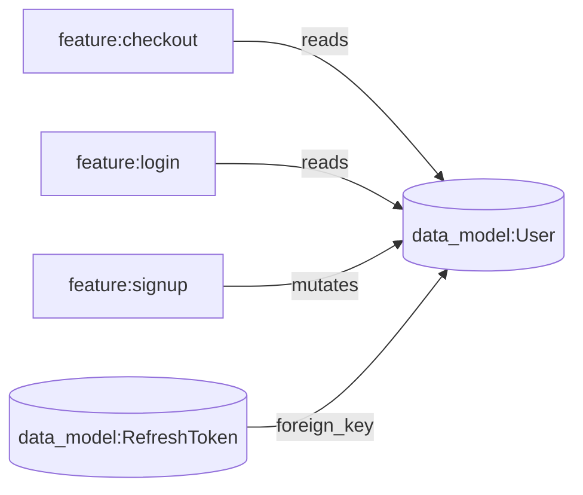

<p align="center">
  
</p>

[](LICENSE)
[](package.json)

## About

TraverSpec turns your product spec into a typed, traversable graph so an AI coding agent can answer "what does this touch?" precisely, instead of reading your entire spec or hoping a similarity search finds the right document. It ships as a CLI that only runs at authoring time: everything it produces is plain markdown and YAML committed to your repo, so there is zero runtime dependency and nothing running in production.

## Overview

Two common ways to give an AI agent context about a codebase both share the same weakness. Flat markdown docs (one big spec file, or one doc per feature) require reading everything to find out what a change affects, which gets expensive or impossible once a real product's spec runs into the hundreds of pages. Vector or RAG search scales past that, but retrieves by semantic similarity, so it has no concept of "this feature enforces that rule" or "this data model is a foreign key of that one" unless the relationship happens to be phrased similarly to the query.

TraverSpec stores specs as a graph instead of a document. Each node (a feature, a data model, an API contract, a business rule, a decision, an epic) is its own small markdown file with human-readable content only. Every relationship between nodes is a typed, directional edge declared in one file, `graph.yaml`. Nothing is inferred from prose proximity or embedding distance; anything traversable is explicit.



To answer "what breaks if I change `User`?", an agent walks the edges pointing at `User` and gets an exact, complete answer: `checkout`, `login`, `signup`, `RefreshToken`. That answer holds regardless of whether the codebase is 20 files or 20,000.

## Installation

```bash
npm install -g traverspec
traverspec --help
```

If `--help` prints the command list, the install worked.

## Quickstart

```bash
traverspec init
```

Scaffolds the `traverspec/` folder (`about.md`, `constitution.md`, `graph.yaml`, `assets/`, and the seven skill files under `skills/`) and adds or updates `AGENTS.md`, read natively by Cursor and most other agentic tools. Safe to run again: existing content is never overwritten, only appended to inside a clearly marked block.

For tools that don't read `AGENTS.md` on their own, like Claude Code, wire up their entry file with `--agent`:

```bash
traverspec init --agent claude
```

This additionally writes `CLAUDE.md` (a one-line import of `AGENTS.md`).

## Structure reference

**Node types**

| Type | Represents |
|---|---|
| `epic` | A grouping label for related features. Filtering only, never appears as an edge. |
| `feature` | A user-facing capability. The most common entry point for implement/explain tasks. |
| `data_model` | The schema and fields for an entity or value object. |
| `api_contract` | One endpoint or operation, REST, GraphQL, WebSocket, or SSE. Always its own node, never a section inside a feature. |
| `business_rule` | A domain constraint or piece of logic that isn't specific to one feature. |
| `decision` | A documented, intentional exception to what would otherwise look like the correct pattern. Always paired with an `overrides` edge. |
| `ui_component` *(optional)* | An interface requirement, a button, a form, a screen element. Skip entirely for backend-only projects. |

**Edge types**

| Type | Meaning |
|---|---|
| `depends_on` | The `from` node can't be understood or implemented without the `to` node already existing. |
| `mutates` | The `from` node writes or changes data owned by the `to` node. |
| `reads` | The `from` node reads data owned by the `to` node without changing it. |
| `triggers` | The `from` node causes the `to` node to execute, typically how a feature is invoked. |
| `enforces` | The `from` node is where a business rule is actually applied or checked. |
| `foreign_key` | A field on the `from` data model references the `to` data model. |
| `calls` | A UI component calls or renders an API contract (only relevant if using `ui_component`). |
| `overrides` | The `from` node (a `decision`) is a documented, intentional exception to the `to` node (a `business_rule`). Traversal checks for one of these on every node it loads, in both directions, since skipping it produces a wrong understanding of the rule rather than just an incomplete one. |
| `dispatches` | The `from` node's completion causes the `to` node to run, asynchronously, out of band, not the same request/response cycle. Distinct from `depends_on` and `triggers`, which describe prerequisite and same-cycle invocation relationships. |

## Commands

| Command | What it does |
|---|---|
| `traverspec init [--agent <names>]` | Scaffold `traverspec/` and wire up agent entry files. Idempotent. |
| `traverspec add-agent <names>` | Wire up an additional tool later without re-scaffolding (`cursor`, `claude`). |
| `traverspec validate [--json]` | Structural and referential integrity check. Non-zero exit on any issue. |
| `traverspec check-plan [--json]` | Check whether `traverspec/plan/plan.md` still matches the current `graph.yaml`, or is stale. |
| `traverspec refresh-skills [--yes]` | Pull in skill-file updates from the installed package version, with confirmation before overwriting any customized file. |
| `traverspec add-codeowners --tool <github\|gitlab>` | Gate changes to `traverspec/` behind review. Never run automatically, opt-in since solo projects don't need it. |
| `traverspec remove [--yes]` | Remove `traverspec/` and agent entry files from this project, after a confirmation prompt. `--yes` skips it for scripted use. |

## Versioning

Everything TraverSpec creates lives in your repo as plain text: `graph.yaml`, the per-node markdown files under `traverspec/assets/`, and the skill files under `traverspec/skills/`. There's no separate database or hosted service to keep in sync, so history, diffs, blame, and branching all come from git the same as any other source file.

To control who can change the spec itself, run `traverspec add-codeowners --tool github` (or `--tool gitlab`). This adds a CODEOWNERS entry scoping the entire `traverspec/` folder, graph content and skill files alike, to an owner you specify, replacing the `@CHANGE_ME` placeholder it writes. On its own this only requests review, it doesn't block merges. To actually enforce it, enable your git host's branch protection on top: GitHub's "Require review from Code Owners", or an equivalent approval rule tied to a protected branch on GitLab.

## Skill files

`init` copies seven markdown files into `traverspec/skills/`. They're what an agent reads to work inside the graph correctly, and they're yours to edit once scaffolded.

| File | Purpose |
|---|---|
| `start_here.md` | Entry point. Tells the agent what to read next depending on the task, and the one rule that applies regardless of what it's about to do. |
| `structure_reference.md` | Defines the node and edge types, file layout, and content schema. What things are, not how to move between them. |
| `traversal_policy.md` | How to gather context for a task: resolving an entry point, forward vs. reverse traversal, and the `constitution.md`/`overrides` exceptions to forward-only traversal. |
| `ingest_spec.md` | Converting an existing document (a PDF, a Notion export, pasted notes) into the graph. |
| `derive_spec_from_code.md` | Generating or reconciling the graph against an existing codebase, when the source of truth is code rather than a document. |
| `author_via_chat.md` | Building a spec through conversation, when the information only exists in someone's head and hasn't been written down anywhere yet. |
| `plan.md` | Deriving a dependency-ordered build plan (features grouped into sequential waves) from the graph's edges plus prose in `traverspec/assets/`. |

## VS Code extension

[traverspec-vscode](https://github.com/alvazone/traverspec-vscode) renders `graph.yaml` as an interactive, explorable node diagram inside VS Code, for browsing the graph visually instead of jumping between files. Not yet published to the VS Code Marketplace; clone and run it from source in the meantime.

## Known limitations

- **Context-scoping only pays off past a real size threshold.** On a small graph, reading everything is cheaper than the fixed cost of an agent learning the routing rules.
- **`depends_on` chains can pull in a large share of the graph for a single task.** If a feature sits downstream of a long prerequisite chain, "implement this feature" can legitimately require most of the graph. That reflects real coupling in the underlying product, not a bug in the tool, but it means minimal context isn't a guaranteed property of using a graph.
- **`validate` checks structural and referential integrity, not semantic accuracy.** Every id can resolve and every edge type can be legal while an edge no longer reflects what the code actually does. Catching that requires the review process in `derive_spec_from_code.md`, not a mechanical check.
- **Monorepo support isn't implemented yet.** A single `traverspec/graph.yaml` per repo is assumed; multiple graphs in one repository (Turborepo-style) isn't supported.

## Status

`0.1.0`, pre-1.0. Following semver, but expect the CLI surface and skill file content to still change between minor versions until a 1.0 release.

## License

MIT
