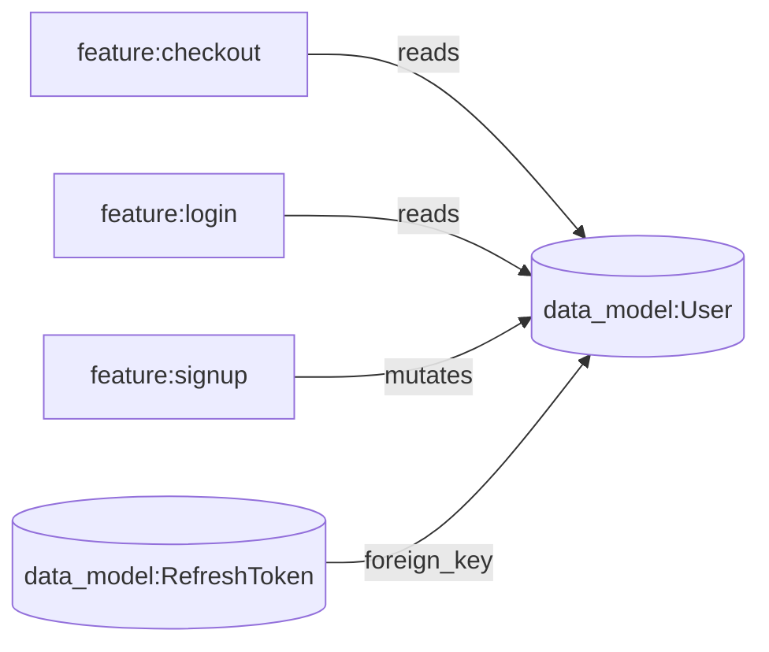

# TraverSpec

**A typed, traversable spec graph for AI coding agents — so an agent can answer "what breaks if I change this?" by walking a graph, not by re-reading your whole codebase or hoping it noticed a stray sentence in a doc.**

[](LICENSE)
[](package.json)

---

## The problem

Two ways teams currently give AI agents context about a codebase, and both fail in the same specific way:

- **Flat markdown docs.** A single sprawling spec file, or one doc per feature. Reading it in means dumping the whole thing into context — cheap on a small project, prohibitively expensive (or literally impossible) once a real product's spec runs into the hundreds of pages.
- **Vector / RAG search.** Scales past the flat-doc ceiling, but retrieves by semantic similarity. It has no concept of *this feature enforces that rule* or *this data model is a foreign key of that one* — relationships that live only in the prose, if they're written down at all.

Neither answers the question that actually matters when you're about to change something: **what else does this touch?** A flat doc makes you read everything to find out. A vector search might not surface the one dependent that matters, because it isn't phrased similarly to your query.

## The idea

Specs live as a **graph**, not a document. Every node — a feature, a data model, an API contract, a business rule, a decision, an epic — is its own small markdown file containing only human-readable content. Every relationship between them is a typed, directional edge declared in one file, `graph.yaml`. Nothing is inferred from prose proximity; everything traversable is explicit.



Ask an agent "what breaks if I change `User`?" and it doesn't need to read your whole repo, and it doesn't need a similarity search to get lucky. It walks the edges pointing *at* `User` and gets an exact, complete answer: `checkout`, `login`, `signup`, `RefreshToken`. That answer is correct regardless of whether the codebase is 20 files or 20,000.

This is the actual differentiator — not "smaller context," which turns out to be conditional (see [Honest tradeoffs](#honest-tradeoffs) below), but **reliable, exhaustive impact analysis on a corpus too large or too unstructured to eyeball.**

## How it's structured

**Node types**

| Type | Represents |
|---|---|
| `epic` | A grouping label for related features. Filtering only — never appears as an edge. |
| `feature` | A user-facing capability. The most common entry point for implement/explain tasks. |
| `data_model` | The schema and fields for an entity or value object. |
| `api_contract` | One endpoint or operation — REST, GraphQL, WebSocket, or SSE. Always its own node, never a section inside a feature. |
| `business_rule` | A domain constraint or piece of logic that isn't specific to one feature. |
| `decision` | A documented, intentional exception to what would otherwise look like the correct pattern. Always paired with an `overrides` edge. |
| `ui_component` *(optional)* | An interface requirement — a button, a form, a screen element. Skip entirely for backend-only projects. |

**Edge types**

| Type | Meaning |
|---|---|
| `depends_on` | The `from` node can't be understood or implemented without the `to` node already existing. |
| `mutates` | The `from` node writes or changes data owned by the `to` node. |
| `reads` | The `from` node reads data owned by the `to` node without changing it. |
| `triggers` | The `from` node causes the `to` node to execute — typically how a feature is invoked. |
| `enforces` | The `from` node is where a business rule is actually applied or checked. |
| `foreign_key` | A field on the `from` data model references the `to` data model. |
| `calls` | A UI component calls or renders an API contract (only relevant if using `ui_component`). |
| `overrides` | The `from` node (a `decision`) is a documented, intentional exception to the `to` node (a `business_rule`). |
| `dispatches` | The `from` node's completion causes the `to` node to run — asynchronously, out of band, not the same request/response cycle. |

Each edge type has one specific meaning, not a generic "related to." `overrides` and `dispatches` exist because two real failure modes kept showing up during design and testing:

- **`overrides`** — traversal always checks for one of these on every node it loads, in both directions — the one deliberate exception to an otherwise forward-only traversal policy, because skipping it doesn't just lose context, it produces a *wrong* understanding of the rule (e.g. "email must be unique" isn't the full picture if a decision exists exempting legacy-merged accounts).
- **`dispatches`** — a directed cause → effect edge for async, out-of-band completion ("when this job finishes, that one runs"), which is easy to state correctly in prose and easy to lose entirely once that prose gets converted into structure. `depends_on` and `triggers` both look similar but mean something narrower; conflating them was a real bug caught during testing, not a hypothetical.

Everything an agent needs to work inside the graph — how to resolve an entry point, when to traverse forward vs. reverse, how to convert an existing doc or codebase into this structure — lives in six markdown skill files that ship with this package and get copied into your repo, fully yours to edit.

## Quickstart

```bash
npm install -g traverspec
cd your-project
traverspec init --agent claude,cursor
```

*(Not yet on the npm registry — see [Status](#status) for running it from source in the meantime.)*

This scaffolds a `traverspec/` folder — `about.md`, `constitution.md`, `graph.yaml`, `assets/`, and the six skill files — and writes `AGENTS.md` (read natively by Cursor and most other agentic tools) plus `CLAUDE.md` (a one-line import, since Claude Code doesn't read `AGENTS.md` on its own). Both are safe to run again: existing content is never overwritten, only appended to inside a clearly marked block.

```bash
traverspec validate
```

Checks `graph.yaml` for referential integrity, illegal node/edge types, structurally malformed entries, correct `overrides` direction, gapless `BR-`/`DC-` numbering, and that all six skill files are present — mechanically, the moment something breaks, instead of leaving it to surface later as confusing agent behavior.

## Commands

| Command | What it does |
|---|---|
| `traverspec init [--agent <names>]` | Scaffold `traverspec/` and wire up agent entry files. Idempotent. |
| `traverspec validate [--json]` | Structural + referential integrity check. Non-zero exit on any issue. |
| `traverspec add-agent <names>` | Wire up an additional tool later without re-scaffolding (`cursor`, `claude`). |
| `traverspec add-codeowners --tool <github\|gitlab>` | Gate changes to `traverspec/skills/` behind review. Never run automatically — opt-in, since solo projects don't need it. |

## Honest tradeoffs

This project exists because I kept finding real problems by testing it against an actual, evolving 190+ node product spec rather than a toy example — and the honest findings mattered more than the pitch:

- **Context-scoping only pays off past a real size threshold.** On a small graph, reading everything is cheaper than the fixed cost of an agent learning the routing rules. It becomes worth it once a corpus is large enough, or has deep enough `depends_on` chains, that "just read it all" stops being feasible — not before.
- **`depends_on` chains can defeat scoping on their own.** A single "implement this feature" task legitimately pulled in over half of a 190-node real graph, because the feature sat downstream of a long prerequisite chain. That's the graph correctly reflecting real coupling, not a bug — but it means "minimal context" isn't a property of the mechanism alone.
- **The validator catches structural drift, not semantic drift.** Every id can resolve and every edge type can be legal while an edge no longer reflects what the code actually does. Catching *that* needs the close-reading process in `derive_spec_from_code.md`, not a mechanical check — worth knowing before assuming a clean `validate` means the spec is still true.
- **A traversal-policy bug shipped in the first draft and was only found by trying to break it.** The policy's own worked example — "what breaks if I change the User table" — was unanswerable under its own forward-only rule until a second, explicit reverse-traversal exception was added for impact-analysis questions specifically. Documented in `traverspec/skills/traversal_policy.md`.

None of this is a caveat buried in fine print — it's the actual design log. A tool that only ships the claims that survived testing is worth more than one that ships the pitch.

## Status

Node/TypeScript CLI, not yet published to the npm registry — clone this repo and `npm install && npm run build` to run it from source in the meantime (`node dist/cli.js <command>`). `VALIDATION_RULES.md` at the repo root is a deliberately language-agnostic spec of everything `validate` checks, kept separate from the implementation so a future port (Python or otherwise) can implement it independently and be tested against the same fixture library — not translated line-by-line from this codebase.

## License

MIT
