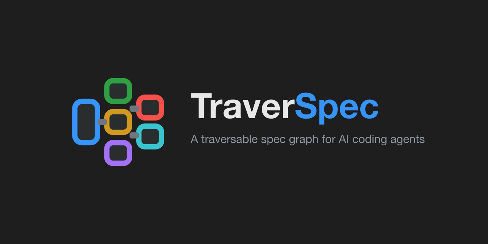
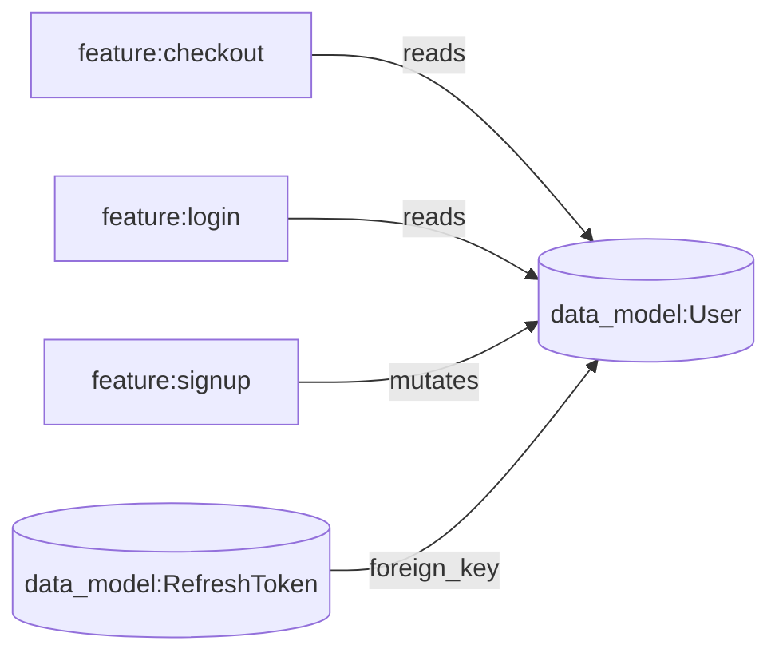
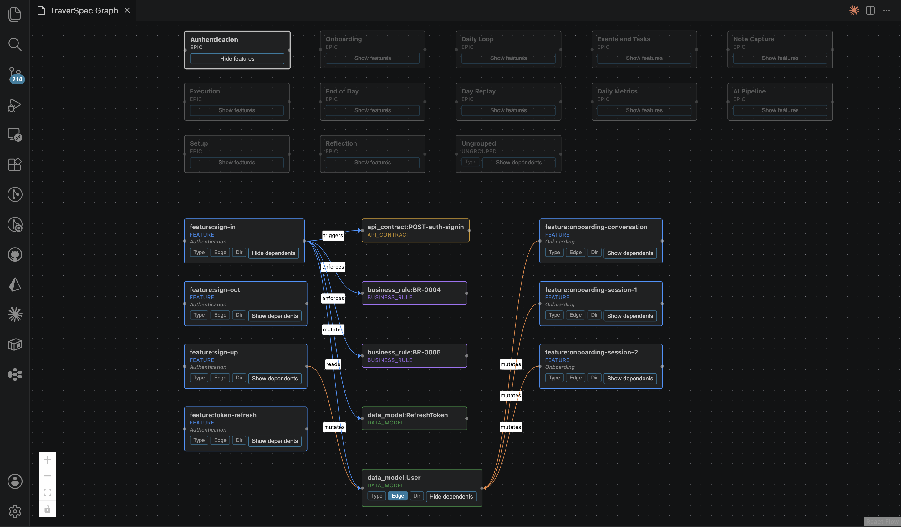
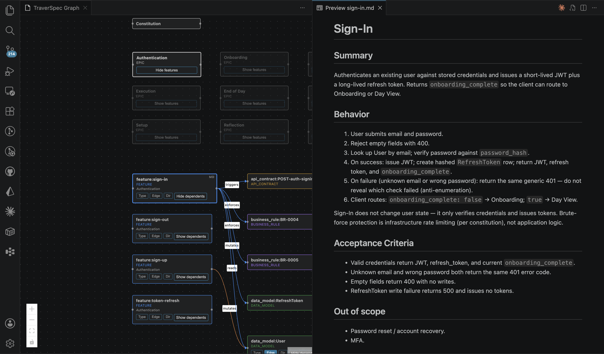

<p align="center">
  
</p>

[](https://www.npmjs.com/package/@alvazone/traverspec)
[](LICENSE)
[](package.json)

## TLDR (For AI Agents)

TraverSpec is a CLI that scaffolds a typed, traversable spec graph — `graph.yaml` plus one small markdown file per node — so an agent can answer "what does this touch?" exactly, instead of reading an entire spec or guessing from similarity search. It only runs at authoring time: everything it produces is plain markdown and YAML committed to the repo, no runtime dependency, nothing running in production.

- Package: `@alvazone/traverspec` (npm, MIT license)
- Install: `npm install --save-dev @alvazone/traverspec`
- Primary commands: `init`, `validate`, `list`, `show <node_id>`, `check-waves`
- `init` scaffolds `traverspec/graph.yaml`, `AGENTS.md`, and skill files that define how to read and write this graph — read those directly for traversal and authoring rules, not this README
- Everything below this section is written for a human reader

---

## For Humans

### 1. The move to SDD

Somewhere in the last few months, a good chunk of the industry decided the right way to build software with an AI agent in the loop is to write the spec down first and let the agent build against it — spec-driven development, SDD if acronyms are your thing. It's a genuinely good idea. It also creates two different sets of problems depending on which side of "we already do SDD" you're standing on.

#### 1.1 Non-SDD dev process problems

If you're not doing SDD yet, here's what your agent — or your newest hire — actually has to work with: the code, and whatever's left of the conversation that produced it. Maybe a Slack thread from four months ago. Maybe a comment that says `// don't touch this, ask Jane Doe`, and Jane Doe left the company in March. Code tells you exactly what happens. It has never once told anyone why. An agent asked to "fix the refund flow" ends up reverse-engineering intent from implementation instead of just being told what the intent was.

#### 1.2 Problems in managing an SDD process

Say you do write the spec down. Congratulations, you now have a second problem: keeping it usable. One giant markdown file, or one file per feature, means answering "what does this touch?" requires reading the whole thing — fine at twenty pages, a genuine ordeal at two hundred. Point a vector search at it instead and you may end up getting a "confidently wrong" answer: RAG retrieves by how similar the words sound, not by what actually depends on what. It will tell you a payments feature and a payroll feature are related because they're both about money, and say nothing about the one that actually shares a database column with the other.

---

### 2. Spec as a graph

TraverSpec's answer to both problems is almost insultingly simple: stop writing the spec as a document, and write it as a graph instead. Every feature, every data model, every business rule gets its own small markdown file — one thing, one file — and every dependency it has on anything else gets declared explicitly, once, in a single file called `graph.yaml`. Each of those edges has a direction and a type, and both carry real meaning: direction says which side depends on the other, and type says exactly how — `reads`, `mutates`, and `foreign_key` all mean different things, and reversing the direction changes the claim entirely. Nothing is inferred from two paragraphs sitting near each other. If it isn't written down as an edge, it doesn't exist as a relationship.


```mermaid
graph LR
    checkout["feature:checkout"] -->|reads| User[("data_model:User")]
    login["feature:login"] -->|reads| User
    signup["feature:signup"] -->|mutates| User
    RefreshToken[("data_model:RefreshToken")] -->|foreign_key| User
```

That same relationship, as it actually sits in `graph.yaml`:

```yaml
nodes:
  - id: feature:checkout
    type: feature
    path: assets/feature/checkout.md
  - id: feature:login
    type: feature
    path: assets/feature/login.md
  - id: feature:signup
    type: feature
    path: assets/feature/signup.md
  - id: data_model:User
    type: data_model
    path: assets/data_model/User.md
  - id: data_model:RefreshToken
    type: data_model
    path: assets/data_model/RefreshToken.md

edges:
  - from: feature:checkout
    type: reads
    to: data_model:User
  - from: feature:login
    type: reads
    to: data_model:User
  - from: feature:signup
    type: mutates
    to: data_model:User
  - from: data_model:RefreshToken
    type: foreign_key
    to: data_model:User
```

Ask "what breaks if I change `User`?" and an agent doesn't skim, summarize, or guess. It walks every edge pointing at `User` and returns the exact, complete answer — `checkout`, `login`, `signup`, `RefreshToken` — whether the codebase has twenty files or twenty thousand.

---

### 3. Graph Maintenance

Most pitches for this kind of tool skip a part that matters: building a graph doesn't automatically keep it honest. You build it iteratively, the same way you build everything else — a feature ships, then it changes three sprints later because the business changed its mind, then someone adds a field nobody thought to mention. Every one of those moments is a chance for the graph to quietly stop matching reality while still looking exactly as tidy and typed as the day it was written.

This is the uncomfortable part of building specs as graphs: swapping a stale document for a stale, beautifully structured graph isn't obviously progress, because a wrong answer delivered with total structural confidence is easier to trust and harder to catch than one buried in an intimidating wall of prose. A tool that hands you a graph and calls it done, with no way to catch drift, has just handed you a more elegant way to be misled.

---

### 4. TraverSpec Intro

#### 4.1 What TraverSpec does

TraverSpec is a CLI that scaffolds exactly this kind of graph into your repo, gives you commands to actually query it, and ships a set of skill files that teach your coding agent how to read from it, write to it, and check it against reality on a regular basis. It only runs at authoring time. Nothing about it runs in production; once the files are written, it gets out of the way.

#### 4.2 Installing and `init` (and `add-agent`)

If the project is a Node project (it has a `package.json`), install it as a dev dependency, the same way you'd install `eslint`:

```bash
npm install --save-dev @alvazone/traverspec
```

If it isn't a Node project — or you just want the CLI available everywhere without pinning it per-project — install it globally instead:

```bash
npm install -g @alvazone/traverspec
```

Then scaffold (drop `npx` if you installed globally):

```bash
npx traverspec init
```

This creates:

```
traverspec/
├── about.md            — your product's Problem/Solution/Goals/Non-Goals
├── constitution.md     — standing, project-wide rules (e.g. "all endpoints require auth")
├── graph.yaml          — the graph itself: epics, nodes, edges
└── assets/
    ├── epic/            — each epic's own md file (a grouping label, e.g. "Billing")
    ├── feature/         — each feature's own md file (a user-facing capability)
    ├── data_model/      — each data model's own md file (an entity's schema and fields)
    ├── api_contract/    — each endpoint's own md file (one per operation)
    ├── business_rule/   — each business rule's own md file (a domain constraint)
    └── decision/        — each decision's own md file (a documented exception to a rule)
```

Additionally:

- **`AGENTS.md` gets written at the repo root**, the file read natively by most agentic tools without any extra configuration. It's written inside a clearly marked block, so re-running `init` later only ever updates that block — anything you've added to the file yourself, inside or outside it, is left alone.
- **The four skills covered below get installed into `.agents/skills/`.** Unlike `AGENTS.md`, these are vendor-managed: every `init` run wipes and reinstalls them fresh, so upgrading to a newer version of TraverSpec always leaves you with current skill content, never a stale copy left over from before.

Both happen every time you run `init`, and running it again is always safe.

Claude Code doesn't read `AGENTS.md` on its own, so if that's your tool, run one more command:

```bash
npx traverspec add-agent claude
```

This writes `CLAUDE.md` and installs the same four skills into `.claude/skills/` — a separate track from the bare command above, so run both if you use both tools.

#### 4.3 Git-native

There's no account to create, no server to stand up, no database holding your spec hostage. `graph.yaml` and every node's markdown file are just files, sitting in your repo, tracked by git like everything else you've written. `git blame` on a business rule gets you a name and a commit message instead of a shrug. Branch it, diff it, review it in a pull request — the same muscle memory you already have for code works here without any adjustment, because git doesn't treat these files any differently just for being a spec.

One nuance worth flagging here: the skill files themselves live under `.agents/skills/` or `.claude/skills/`, and those particular folders commonly end up in `.gitignore` by convention, since they often hold machine-specific tool configuration. Because of that, cloning a repo won't necessarily bring the skills along with it — only the `traverspec/` folder itself is guaranteed to be there. Running `init` again in the fresh clone is a safe operation; it reinstalls the skills without touching anything else.

---

### 5. TraverSpec Skills

By the time `init` (or `add-agent`) finishes, you have everything an agent needs to actually work inside this graph: four skill files, plus a set of tools those skills lean on. This section goes deeper than a feature list — the mechanics here are the actual product, so it's worth seeing how each one really operates.

Walking `graph.yaml` by reasoning through it, token by token, is slow, and it won't always give the same answer twice. So instead, the CLI has real commands that do this work, and the skills just call them. That keeps results consistent, and it means the skills spend their tokens on judgment calls, not on tasks a small program already handles correctly.

#### 5.1 Tools

**`traverspec list`**

```bash
traverspec list [--type <type>] [--json]
```

What it does: prints a lightweight index of every node — id, type, title, and a short description — so a skill can resolve a task's wording to an actual node id before doing anything else.

Params:
- `--type` — narrows the output to one node type (`feature`, `data_model`, etc.) instead of the whole graph.
- `--json` — returns the same fields as structured objects instead of formatted text.

**`traverspec show`**

```bash
traverspec show <node_id>[,<node_id>...] [--direction forward|reverse|both] [--json]
```

What it does: computes the full dependency or impact closure for one or more nodes — every node and edge reachable from the starting point, grouped by hop distance, with no depth limit.

Params:
- `--direction` — controls which way the graph gets walked: `forward` for what this depends on, `reverse` for what depends on this, `both` for either.
- Multiple comma-separated ids — passed as a single combined start set.
- `--json` — returns structured levels/nodes/edges instead of formatted text.

**`traverspec validate`**

```bash
traverspec validate [--json]
```

What it does: a structural and referential integrity check — every id resolves, every type is legal, every asset file exists and isn't blank — exiting non-zero if anything's wrong.

Params:
- `--json` — returns findings as structured objects instead of a formatted report.

**`traverspec check-waves`**

```bash
traverspec check-waves [--json]
```

What it does: compares the graph snapshot a previous wave plan was generated from against the current `graph.yaml`, and reports whether that plan is still trustworthy or has gone stale.

Params:
- `--json` — returns the status as a structured object instead of a formatted message.

#### 5.2 Skills

##### 5.2.1 `traverspec-read`

**What it does:** gathers exactly the context needed to implement something, explain how it works, or figure out what a change would break — no more, no less.

**What triggers it:** "implement checkout," "how does the refund flow work," "what breaks if I change `User`."

**How it uses the tools:** resolves the starting node via `traverspec list`, then runs `traverspec show <id> --direction ...` to compute the full closure.

**How it works**
- Direction isn't really a judgment call — it's a lookup: `forward` for implement/explain tasks, `reverse` for "what depends on this" impact questions, `both` when it's genuinely unclear which applies.
- The closure only tells you which nodes are connected. The skill forces the agent to read the contents of each node's `.md` file — it never stops at the closure alone.
- Not every edge gets read with the same care: `depends_on` gets read closely (real structural coupling), `reads` only needs a glance unless the specific fields being touched are among what it reads, and `overrides` gets read every single time, no exceptions — skipping it doesn't just leave a gap, it produces an actively wrong understanding of the rule it's attached to.
- Large results don't get trimmed down by guesswork. "65 of 180 nodes covered" is a real number from a real graph — it just means the product is that coupled, and the skill is told to leave it alone.

##### 5.2.2 `traverspec-write`

**What it does:** writes a new fact into the graph, or corrects one already there, using whatever evidence exists — a document, code, or something said directly. Clear facts get written right away; anything unclear gets a question instead of a guess.

**What triggers it:** creating or updating a node or edge, ingesting a document, deriving from code, or authoring through conversation.

**How it uses the tools:** checks `traverspec list` for a duplicate before creating anything new, and runs `traverspec validate` once it's written — a clean structural check is necessary, but nowhere near sufficient on its own.

**How it works**

This is the skill with the most judgment built into it, because its decision to write depends on the evidence it gathers and the risk that evidence poses. Evidence can come in three forms — a document, a conversation, or existing code — and each has its own risk profile.

**Evidence**

**Document**
- Risk: mixes clean facts with facts that are true but structurally ambiguous.
- Gating: two things mentioned in the same paragraph don't automatically imply a relationship — the skill won't infer an edge just from proximity in the text.

**Conversation**
- Risk: usually the highest-confidence evidence there is, but a half-formed thought can get captured as if it were already settled.
- Gating: the skill waits until an idea sounds decided, not just stated, before treating it as ready to write.

**Code**
- Risk: code shows what happens, not why. A bug can look exactly like a deliberate rule. If it gets written into the graph as a confirmed rule, the next person — or agent — reading it will trust it and build on top of it.
- Gating: for a `business_rule`, code can prove the **Statement** is true, so that part gets written with high confidence. It can't prove the **Rationale** — code never explains itself, even when there's a test for it. Anything that looks like it could be unintentional gets flagged as "found in code, unclear if intentional" instead of written as settled fact.

When two sources disagree — the code says one thing, an existing node says another — the skill never quietly picks a side. It surfaces the specific discrepancy and asks.

##### 5.2.3 `traverspec-reconcile`

**What it does:** the answer to the graph maintenance nightmare from Section 3. Compares existing nodes against the code they describe and sorts every finding into match, drift, or new, without quietly assuming either side is right.

**What triggers it:** you asking for it directly, a start-of-session habit before piling on new work, or after code files get edited — though that last one only fires automatically if you've opted into `traverspec add-hooks`.

**How it uses the tools:** scopes the check with `traverspec show` instead of auditing the whole graph at once, and falls back to `traverspec list` to map changed files back to graph nodes when it was triggered by a hook rather than a stated task.

**How it works**
- It works through one node at a time — "does this still hold" is a small, bounded question for each one.
- **Match** needs a real citation — a file, a function, a test name it actually looked at, not just a claim that it checked and everything looked fine.
- **Drift** never gets silently resolved in either direction — the code isn't automatically right just because it's newer, and the existing node isn't automatically right just because it's already there. It gets reported as a specific, named discrepancy, and a human decides which side wins.
- **New** — something in the code with no matching node or edge — gets flagged to the person, asking whether it should be written. If yes, it hands off to `traverspec-write` rather than authoring it inline here. Reconcile checks, it doesn't create.
- When triggered by an `add-hooks` nudge instead of a stated task, there's no clean entry point to start from, just a list of changed files. It uses `traverspec list` to look for a plausible match (a changed `user.service.ts` is worth checking against `data_model:User`), and if nothing lines up, it says so and asks rather than guessing or reconciling everything.

##### 5.2.4 `traverspec-waves`

A wave is a group of features that can all be built at the same time, because nothing in that group depends on anything else in it. Wave 2 can't start until everything in Wave 1 is done, but features inside the same wave have no order between them — work through them in any order, or in parallel.

**What it does:** turns your `depends_on`/`dispatches` edges into a build order like that — a list of waves, in sequence, each one a group of features that can move together.

**What triggers it:** "what should we build first," a roadmap request, anything phrased in terms of stages or sprints.

**How it uses the tools:** if `traverspec/waves/waves.md` doesn't exist yet, it runs the bundled `wave-skeleton.js` script to build the wave order, then reads the actual specs on top of it (see below). If a wave plan already exists, it runs `traverspec check-waves` first — a current plan gets reused as-is, a stale one gets regenerated from scratch.

**How it works**
- The script reads every feature's `depends_on` and `dispatches` edges and works out which wave it belongs to, along with a reason for that placement. A feature with nothing pointing at it can start in Wave 1. A feature with a direct edge of its own goes right after whatever it depends on. That's solid evidence. A feature placed only because it inherited a rule from a sibling feature in its epic, or only because it shares a data model with another feature, is placed on thinner evidence. A few features are trickier still. Some get grouped together because they genuinely depend on each other. Some get flagged because two rules about where they should go actually contradict each other. The script's placement is final for the clear-cut cases. The thinner and tougher cases are just a starting point, and the skill hands those specific features off for a closer look, reading their actual specs to settle them properly.
- Some real ordering facts are never written as an edge, so the skill also reads the actual feature specs. It only does this for the features the script placed on thin evidence. It's mainly checking one thing: does this feature only work because another feature already created something it needs? Two features touching the same data, on its own, rarely counts as an order. Usually it just means they're both working with the same data independently.
- The output file, `traverspec/waves/waves.md`, is a wave-ordered checklist of features. Each feature also gets marked done or still in progress, based on whether the code for it actually exists. It needs a real file or test as proof. This is a completion check only. It says whether something got built. Whether what got built still matches the spec is a separate question, and that's `traverspec-reconcile`'s job.

**Token Cost**

That's the four skills TraverSpec installs, and the tools each one leans on to stay fast and accurate. They aren't equally cheap on tokens, though. `traverspec-read`, `traverspec-write`, and `traverspec-reconcile` all stay scoped to whatever the task actually needs — one entry point, one batch of facts, one node at a time — so their token cost stays scoped too. `traverspec-waves` doesn't get that luxury. It has to look at every feature in the graph to build a wave order, then read specs for anything the mechanical pass wasn't confident about, then check each feature's implementation against its edges for the completion checklist. That's a lot of content to read through on a graph of any real size, and it's genuinely the most token-hungry of the four skills. Run it deliberately, when you actually need a build order or a status check, not as a casual way to browse the graph.

Every skill above is built with one goal: keep the agent aware of drift and compliant with the spec. Yet the atomic spec files and `graph.yaml` themselves were never built to give a human a good way to evaluate them. That problem gets solved next.

---

### 6. Graph Visualisation (VS Code Extension)

#### 6.1 How managing many atomic markdown files becomes a high-effort problem

A graph made of a handful of files is charming. A graph made of two hundred small, single-purpose markdown files spread across seven folders is a genuine chore to navigate.

#### 6.2 VS Code Extension

[TraverSpec Graph Explorer](https://marketplace.visualstudio.com/items?itemName=alvazone.traverspec-vscode) renders `graph.yaml` as an actual, clickable node diagram inside VS Code, so relationships you'd otherwise reconstruct from IDs and file paths are just there, on screen.



The graph is interactive — nodes expand and collapse on demand, so you're never stuck looking at the whole thing at once. Clicking a node pulls up its exact asset spec file right alongside the diagram, so going from "what does this connect to" to actually reading the file takes one click.



#### 6.3 Open VSX

The extension is also published on [Open VSX](https://open-vsx.org/extension/alvazone/traverspec-vscode), the open marketplace VSCodium and other non-Microsoft, VS Code-compatible IDEs use. Same extension, same features — install it from whichever marketplace your editor actually reads from.

---

### 7. Suggested Development Workflows

TraverSpec is designed to fit into your usual development workflow without getting in the way. But since the actual decision to run a skill is made by the agent, it's possible the agent won't call the relevant skill exactly when it should. When that happens, you can force it directly with a slash command like `/traverspec-write`.

#### 7.1 Greenfield projects

- TraverSpec can double as your spec organizer while you brainstorm and plan.
- Create an empty repo, run `traverspec init` to scaffold it, and continue your design and planning session with your agent as usual.
- As an idea takes shape, or a feature's design gets locked in, make sure your agent is actively writing it into TraverSpec.
- If you notice the agent missed recording a decision, design, or spec, nudge it with something like "write this to TraverSpec" and it will pick up the relevant skill on its own. Or call `/traverspec-write` directly to invoke it yourself.
- Once a good chunk of the design is recorded, consciously evaluate the spec content itself — check whether the agent has hallucinated a claim, or written a business rule that isn't actually real. The graph explorer extension is the best way to do this: look at the actual content, not just whether the structure looks complete.

#### 7.2 Brownfield projects

- If you already have an in-progress repo with existing code, once TraverSpec is set up, just ask your agent to generate the spec from the code — this gets the agent to invoke `traverspec-write` with code as its starting point.
- The skill pushes the agent to go feature by feature, so spec construction stays scoped and the chances of hallucination stay low.
- You can ask the agent to run a full pass over the codebase without stepping in, but that pushes the agent to make decisions that really should get a human review.
- Consciously evaluate the spec content as it's written — check for hallucinated claims, or business rules the agent has enforced that aren't actually real. The graph explorer extension is the best way to do this: look at the actual content directly.
- In testing, TraverSpec derived specs from large codebases at ~90% accuracy without human intervention, though we actively discourage relying on fully autonomous spec generation.

#### 7.3 Regular development

- In day-to-day development, your agent uses TraverSpec to continuously check the spec against the code, keeping drift to a minimum.
- TraverSpec's skills have strong confidence-gating built in, which forces the agent to pause and surface ambiguity whenever its confidence is medium or lower.
- After a sizeable amount of code gets written, the agent will often reconcile code against spec on its own. As a general practice, though, it's better to explicitly ask your agent to reconcile at regular intervals rather than rely on that.

#### 7.4 Forced reconcile

- Your agent will usually reconcile code against spec after a sizeable write, but you can enforce reconciliation after every single write with `traverspec add-hooks <tool>`.
- This adds a hook into your agent's lifecycle that calls `traverspec-reconcile` after every code change.
- This is currently only available for Cursor and Claude Code.
- We don't think that level of brute-force reconciliation is usually necessary — a nudge to reconcile after a sizeable chunk of code, or while building a sensitive feature, is usually enough.

---

### 8. Team & ecosystem

#### 8.1 `add-codeowners`

Once the graph is worth trusting, it's worth protecting the same way you'd protect anything else that matters:

```bash
traverspec add-codeowners --tool github
```

This adds a CODEOWNERS entry over the entire `traverspec/` folder — the graph and the skill files both — so a change to the shared spec asks for review the same way a change to production code would. On its own this only requests review; turn on your git host's branch protection (GitHub's "Require review from Code Owners," or GitLab's equivalent approval rule) to actually enforce it.

#### 8.2 Cloning a repo that already has TraverSpec set up

The easiest way to tell if a repo already uses TraverSpec is to check for a `traverspec/` folder at the project root. If you've just cloned a repo where someone already ran `init`, the graph and `AGENTS.md` are already sitting there, committed like everything else. The skill files might not be, though — `.agents/skills/` and `.claude/skills/` are commonly gitignored, for the same reason covered in Section 4.3. Run `traverspec init` again regardless; it's safe and idempotent, and it'll restore the skills if they didn't survive the clone. The only other thing worth checking is whether the CLI itself is installed (look in `package.json`'s `devDependencies`, or install it yourself).

---

And always remember

## This is AI and can make mistakes. Please double-check responses 🤖🔍

---

### 9. Schema & Command Reference

**Node types**

| Type | Represents |
|---|---|
| `epic` | A grouping label for related features. Filtering only, never appears as an edge. |
| `feature` | A user-facing capability. The most common entry point for implement/explain tasks. |
| `data_model` | The schema and fields for an entity or value object. |
| `api_contract` | One endpoint or operation, REST, GraphQL, WebSocket, or SSE. Always its own node, never a section inside a feature. |
| `business_rule` | A domain constraint or piece of logic that isn't specific to one feature. |
| `decision` | A documented, intentional exception to what would otherwise look like the correct pattern. Always paired with an `overrides` edge. |
| `ui_component` *(optional)* | An interface requirement, a button, a form, a screen element. Skip entirely for backend-only projects. |

**Edge types**

| Type | Meaning |
|---|---|
| `depends_on` | The `from` node can't be understood or implemented without the `to` node already existing. |
| `mutates` | The `from` node writes or changes data owned by the `to` node. |
| `reads` | The `from` node reads data owned by the `to` node without changing it. |
| `triggers` | The `from` node causes the `to` node to execute, typically how a feature is invoked. |
| `enforces` | The `from` node is where a business rule is actually applied or checked. |
| `foreign_key` | A field on the `from` data model references the `to` data model. |
| `calls` | A UI component calls or renders an API contract (only relevant if using `ui_component`). |
| `overrides` | The `from` node (a `decision`) is a documented, intentional exception to the `to` node (a `business_rule`). Checked on every node loaded, in both directions, regardless of task. |
| `dispatches` | The `from` node's completion causes the `to` node to run, asynchronously, out of band — not the same request/response cycle as `triggers`. |

**Commands**

| Command | What it does |
|---|---|
| `traverspec init` | Scaffold `traverspec/`, install skills to `.agents/skills/`, and write `AGENTS.md`. Idempotent. |
| `traverspec add-agent [claude]` | Wire up an additional tool later without re-scaffolding — bare for any AGENTS.md-reading tool, `claude` for CLAUDE.md + `.claude/skills/`. |
| `traverspec validate [--json]` | Structural and referential integrity check. Non-zero exit on any issue. |
| `traverspec list [--type <type>] [--json]` | Lightweight id/type/title/description index of every node, for resolving a node id before using `show`. |
| `traverspec show <node_id>[,<node_id>...] [--direction forward\|reverse\|both] [--json]` | Dependency/impact closure for one or more nodes, grouped by level. Direction defaults to `both`. |
| `traverspec check-waves [--json]` | Check whether `traverspec/waves/waves.md` still matches the current `graph.yaml`, or is stale. |
| `traverspec add-codeowners --tool <github\|gitlab>` | Gate changes to `traverspec/` behind review. Opt-in, never run automatically. |
| `traverspec add-hooks <cursor\|claude>` | Wire up an opt-in nudge to run `traverspec-reconcile` after editing code, before finishing a turn. Requires `jq`. |
| `traverspec remove-hooks <cursor\|claude>` | Remove only the hook entries `add-hooks` added, leaving any other hooks untouched. |
| `traverspec remove [--yes]` | Remove `traverspec/` and agent entry files from this project, after a confirmation prompt. |

---

### 10. Status and License

`0.9.0`, pre-1.0. It follows semver, but treat the CLI surface and skill file content as still capable of moving between minor versions until 1.0 actually lands.

MIT licensed. Use it, fork it, or open an issue if something about it bugs you.

---

### 11. Support

Found a bug, or something about this reads confusing? [Open an issue](https://github.com/alvazone/traverspec/issues) — that's what it's there for.
